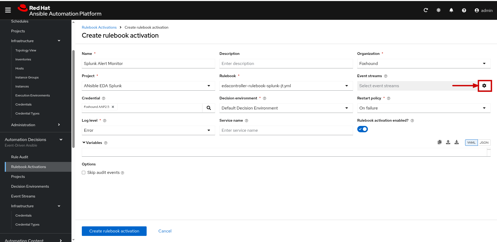
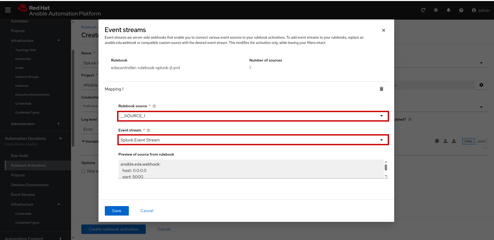
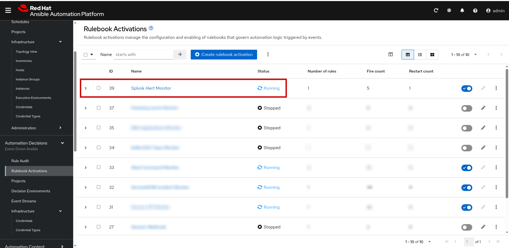

# ansible-eda-splunk
This repo is for demoing Event Driven Ansible's integration with Splunk using the newly released Red Hat Event Driven Ansible Add-on For Splunk application.

Notes:

- There is currently no dedicated plugin for Splunk to be used in rulebooks, instead, depends on how the Red Hat Event Driven Ansible Add-on For Splunk is configured, either  `ansible.eda.webhook` or `ansible.eda.kafka` event source plugins will be used.

This is a step by step to configuring AAP 2.5 and Splunk to enable notifications to be sent to EDA using a webhook in the Red Hat Event Driven Ansible Add-on For Splunk.

TODO: Add Kafka example

Configuration steps:

Ansible Automation Platform:

on the EDA side, we will need to create an event stream for the alerts recieved from Splunk, a Token for authenticating to the event stream, and a rulebook activation.

1. Logon to AAP
2. Under `Automation Decisions`, expand `infrastructure`, click on `credentials`, and click on `Create credential`
3. Enter a name for the credential, and choose  `Token Event Stream` for the credential type, then enter a value for the token, then click on `create credentia`l to save it.

4. Under `Automation Decisions`, click on `Event Streams`, and click on `Create Event Stream`

5. Enter all the details for the new Event Stream, make sure to select `Token Event Stream` for the event stream type, and select the credential you created earlier for the `Credential` field, then Click on `Create event stream`.

6. Make note of the `URL` for the newly created Event stream as we will need it later for configuration on the Splunk side.

7. Under `Automation Decisions`, click on `Projects`, and Create a new project to point to the git repo containing your rulebook.

8. Under `Automation Decisions`, click on `Rulebook Activations`, and click on `Create rulebook Activation`. ENter the details of the new Activation, and click on the gear icon in the `Event stremas` field to map the Event stream created earlier to the source in the rulebook.

9. Choose the Event stream name created earlier, and make sure that it maps to the correct source in the rulebook. Since we only have one source it will automatically be selected (the preview should help with the verification). Click on `save`.

10. Click on `Create rulebook activation` - The rulebook activation should now start, and will eventually be in the running state.

